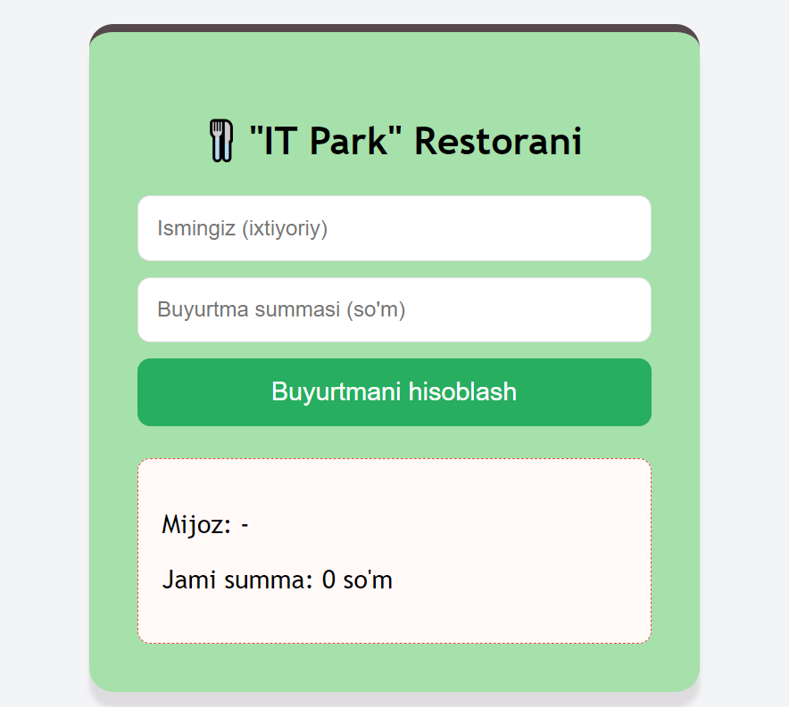

# 🍴 "IT Park" Smart Restaurant System

Ushbu loyiha **JavaScript DOM API** va **Short-Circuit** operatorlarini amalda qo'llashni o'rganish uchun yaratilgan sodda, ammo aqlli buyurtma hisoblash tizimidir.

## 📖 Loyiha Haqida

Tasavvur qiling, siz restoranga kirdingiz. Ofitsiant sizdan ismingizni so'radi, agar aytmasangiz, u sizga baribir **"Hurmatli mijoz"** deb murojaat qiladi. Taom buyurtma qilganingizda esa, agar hisobingiz **100,000 so'mdan** oshsa bunday mijozlarga **10% chegirma** belgilangan bo'lsin va kassa apparati avtomatik ravishda **10% chegirma** kvitansiyasini chiqarib berishi kerak. Ushbu dastur aynan shu jarayonni raqamli ko'rinishda bajaradi.

---



## 🛠 Ishlatilgan Texnologiyalar

- **HTML5** - Tizimning "skeleti" (inputlar, tugmalar).
- **CSS3** - Dizayn va vizual ko'rinish (restoran kvitansiyasi ko'rinishi).
- **JavaScript (ES6+)** - Tizimning "miyasi" (hisob-kitob va mantiq).

---

## 🧠 Kodning Mantiqiy Formulalari

Dasturda JavaScript-ning eng qudratli va qisqa usullari (Short-Circuit) ishlatilgan:

### 1. Default Qiymat (Zaxira rejasi) — `||` (OR)

Foydalanuvchi ma'lumot kiritishni unutsa, dastur xato bermaydi, balki zaxiradagi qiymatni oladi.

> **Formula:** `const natija = kiritilgan_qiymat || "Standart_qiymat";`

### 2. Shartli Ijro (Qorovul) — `&&` (AND)

Agar shart bajarilsa, keyingi amalni bajar, aks holda to'xta.

> **Formula:** `shart && (bajarilishi_kerak_bo'lgan_kod);`

---

## 💻 Kod Strukturasi va Izohlar

### JavaScript (`proyekt1.js`)

```javascript
/**
 * Asosiy hisoblash funksiyasi
 */
function checkOrder() {
	// 1. DOM API yordamida elementlarni ushlab olamiz (Selection)
	const mijoz_ismi = document.getElementById("ismi").value;
	const mahsulot_narxi = Number(document.getElementById("narxi").value);

	const default_ismi = document.getElementById("default_ismi");
	const chegirma_narxi = document.getElementById("narx_chegirma");
	const promoMsg = document.getElementById("promo-msg");

	// 2. ISMNI ANIQLASH (|| operatori)
	// Ism yo'q bo'lsa (falsy), "Hurmatli mijoz" tanlanadi
	const mijoz = mijoz_ismi || "Hurmatli mijoz";
	default_ismi.innerText = "Mijoz: " + mijoz;

	// 3. SUMMANI TEKSHIRISH (&& operatori)
	// Agar narx 0 dan katta bo'lsa, ekranga chiqaradi
	mahsulot_narxi > 0 &&
		(chegirma_narxi.innerText = "Jami summa: " + mahsulot_narxi + " so'm");

	// 4. CHEGIRMA MANTIQI (Boolean bayroqcha)
	// Shart natijasini true yoki false sifatida saqlaydi
	const chegirmaBormi = mahsulot_narxi >= 100000;

	// Har gal yangi hisobda eski xabarni tozalaymiz
	promoMsg.innerText = "";

	// Faqat chegirma bo'lsa (true) tabrik xabarini ko'rsat
	chegirmaBormi &&
		(promoMsg.innerText = "🎁 Tabriklaymiz! Sizga 10% chegirma berildi!");

	// Faqat chegirma bo'lsa, narxni 10% ga kamaytirib ko'rsat (0.9 koeffitsient)
	chegirmaBormi &&
		(chegirma_narxi.innerText =
			"Chegirma bilan: " + mahsulot_narxi * 0.9 + " so'm");

	// 5. VALIDATSIYA (Xatolikni poylash)
	// Agar narx kiritilmasa yoki 0 bo'lsa, ogohlantirish beradi
	mahsulot_narxi || alert("Iltimos, buyurtma summasini kiriting!");
}
```

---

## 🚀 Loyihani Ishga Tushirish

1. Barcha fayllarni (`proyekt1.html`, `proyekt1.css`, `proyekt1.js`) bitta papkaga joylashtiring.
2. `proyekt1.html` faylini brauzerda oching.
3. Ismingizni va summani kiriting (masalan: 150,000).
4. "Buyurtmani hisoblash" tugmasini bosing.

---

## 📈 Kelajakdagi Rejalar (Roadmap)

- [ ] Bir nechta taomlarni tanlash imkoniyatini qo'shish.
- [ ] Buyurtmani PDF ko'rinishida yuklab olish.
- [ ] Real vaqt rejimida (tugmani bosmasdan) hisoblash.

---

**Muallif:** Anvar Otabekovich
**Sana:** 2026-yil, 14-yanvar

---
