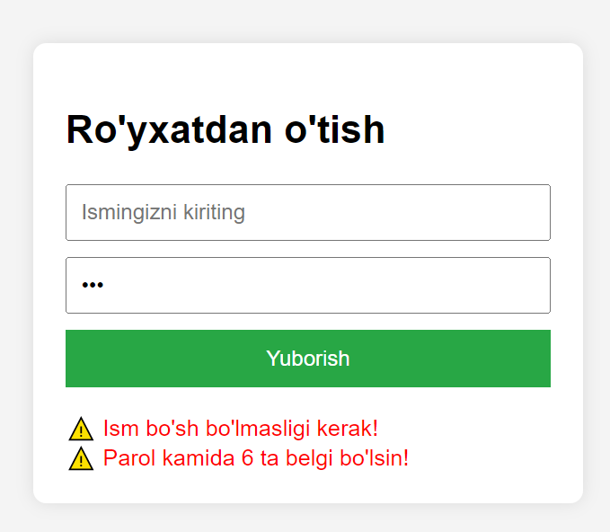

# Shartli Operatorlar:

```javascript
if (shart1) {
	// kod
}
if (shart2) {
	// kod
}
if (shart3) {
	// kod
} else {
	// faqat shart3 xato bo'lsa ishlaydi
}
```

Ushbu proyekt `if` operatorining ikki xil ishlash usulini tushuntiradi.

### Proyekt 1: Ketma-ket IFlar

- **Fayllar:** `proyekt1.html`, `proyekt1.css`, `proyekt1.js`
- **Mantiq:** Har bir `if` alohida ishlaydi. Masalan, ism kiritmasangiz VA parolingiz 123 bo'lsa, har ikkala xatoni ham ko'rasiz.
- **Qachon ishlatiladi:** Bir vaqtning o'zida bir nechta shartni tekshirish kerak bo'lganda.


